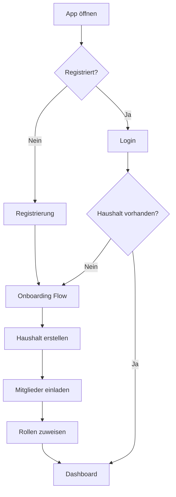

# muutto - Workflow Dokumentation

## 🚀 User Journey - Kompletter Umzugsprozess

### Phase 1: Onboarding (Tag 0)


### Phase 2: Planung (8-12 Wochen vor Umzug)
```
1. Checklisten generieren
   ├── Basierend auf Haushaltsdaten
   ├── Rollenzuteilung automatisch
   └── KI-Empfehlungen integrieren

2. Team organisieren
   ├── Einladungen versenden
   ├── Aufgaben delegieren
   └── Fortschritt verfolgen

3. Fristen überwachen
   ├── Kündigungsfristen berechnen
   ├── Erinnerungen setzen
   └── Deadlines visualisieren
```

### Phase 3: Vorbereitung (4-8 Wochen vor Umzug)
```
1. Verträge verwalten
   ├── Bestehende Verträge erfassen
   ├── Kündigungen schreiben
   └── Neue Anbieter recherchieren

2. Behördengänge planen
   ├── Regionale Anforderungen
   ├── Terminvereinbarungen
   └── Dokumente vorbereiten

3. Logistik organisieren
   ├── Umzugsfirma buchen
   ├── Transporter reservieren
   └── Helfer koordinieren
```

### Phase 4: Durchführung (Umzugstag)
```
1. Koordination
   ├── Zeitplan überwachen
   ├── Team kommunizieren
   └── Probleme lösen

2. Dokumentation
   ├── Übergabeprotokolle
   ├── Fotos für Versicherung
   └── Schäden dokumentieren

3. Erste Schritte
   ├── Notfall-Karton finden
   ├── Utilities aktivieren
   └── Sicherheit prüfen
```

### Phase 5: Nachbereitung (0-12 Monate nach Umzug)
```
1. Sofort (0-4 Wochen)
   ├── Ummeldungen abschließen
   ├── Nachbarn kennenlernen
   └── Wichtigste Einrichtung

2. Mittelfristig (1-3 Monate)
   ├── Kaution zurückfordern
   ├── Nebenkostenabrechnung
   └── Neue Routinen etablieren

3. Langfristig (3-12 Monate)
   ├── Zufriedenheit bewerten
   ├── Verbesserungen umsetzen
   └── System archivieren
```

## 👥 Rollen-spezifische Workflows

### Vertragsmanager Workflow
```
1. Verträge erfassen
   ├── Banking API nutzen (optional)
   ├── Manuell eingeben
   └── Dokumente scannen

2. Kündigungsfristen berechnen
   ├── Automatische Berechnung
   ├── Erinnerungen setzen
   └── Kalender synchronisieren

3. Schreiben generieren
   ├── Vorlagen nutzen
   ├── Automatisch ausfüllen
   └── Versand organisieren

4. Neue Verträge
   ├── Anbieter vergleichen
   ├── Konditionen prüfen
   └── Abschluss koordinieren
```

### Packbeauftragte Workflow
```
1. Inventar erstellen
   ├── Räume durchgehen
   ├── Gegenstände kategorisieren
   └── Wertgegenstände markieren

2. Packmaterial organisieren
   ├── Bedarf berechnen
   ├── Material besorgen
   └── Werkzeuge bereitstellen

3. Packen koordinieren
   ├── Reihenfolge planen
   ├── Team einteilen
   └── QR-Codes vergeben

4. Transport vorbereiten
   ├── Kartons beschriften
   ├── Ladung optimieren
   └── Inventar dokumentieren
```

### Finanzperson Workflow
```
1. Budget erstellen
   ├── Kostenschätzungen einholen
   ├── Kategorien definieren
   └── Puffer einplanen

2. Ausgaben verfolgen
   ├── Belege sammeln
   ├── Kategorisieren
   └── Budgetvergleich

3. Kautionen verwalten
   ├── Alte Kaution zurückfordern
   ├── Neue Kaution hinterlegen
   └── Zinsen berechnen

4. Abrechnung
   ├── Steuerliche Aspekte
   ├── Erstattungen beantragen
   └── Nachkalkulation
```

## 🤖 KI-Assistent Workflows

### Tägliche Routines
```
1. Morgenupdate
   ├── Heutige Aufgaben
   ├── Wichtige Fristen
   └── Wetterinfo für Umzugstag

2. Abendreflexion
   ├── Erledigte Aufgaben
   ├── Morgen geplant
   └── Probleme identifiziert

3. Wochenplanung
   ├── Kommende Meilensteine
   ├── Anpassungen vorschlagen
   └── Tipps personalisieren
```

### Proaktive Unterstützung
```
1. Fristen-Monitoring
   ├── Kritische Deadlines
   ├── Puffer-Zeit berechnen
   └── Alternativen vorschlagen

2. Problem-Lösung
   ├── Häufige Probleme erkennen
   ├── Lösungen vorschlagen
   └── Experten empfehlen

3. Optimierung
   ├── Workflow analysieren
   ├── Verbesserungen identifizieren
   └── Best Practices teilen
```

## 📊 Fortschritts-Tracking

### Metriken
```typescript
progress_metrics = {
  overall: "Gesamt-Fortschritt (0-100%)",
  tasks_completed: "Erledigte Aufgaben",
  days_remaining: "Tage bis Umzug",  
  phase_progress: "Fortschritt aktuelle Phase",
  team_activity: "Team-Aktivität",
  risk_factors: "Risiko-Indikatoren"
}
```

### Berechnung
```typescript
overall_progress = (
  tasks_completed * 0.7 +
  time_progress * 0.3
)

time_progress = Math.min(100, 
  (days_passed / total_days) * 100
)
```

### Visualisierung
- **Dashboard Cards**: Schnellübersicht
- **Progress Bars**: Detaillierte Ansicht
- **Timeline**: Phasen-Übersicht
- **Charts**: Trend-Analyse (geplant)

## 🔄 Integrations-Workflows

### E-Mail Integration
```
1. Einladungen versenden
   ├── Personalisierte Links
   ├── Rollenbeschreibung
   └── Getting-Started Guide

2. Erinnerungen
   ├── Wöchentliche Zusammenfassung
   ├── Kritische Fristen
   └── Team-Updates

3. Berichte
   ├── Fortschritts-Reports
   ├── Problem-Alerts
   └── Erfolgsmeldungen
```

### Kalender Integration (geplant)
```
1. Synchronisation
   ├── Google Calendar
   ├── Outlook
   └── Apple Calendar

2. Event-Types
   ├── Deadlines
   ├── Termine
   └── Meilensteine

3. Benachrichtigungen
   ├── Native Kalender-Alerts
   ├── Cross-Platform Sync
   └── Team-Kalendar (shared)
```

## 🚨 Notfall-Workflows

### Problem-Eskalation
```
1. Problem identifiziert
   ├── Automatisch (System)
   ├── User Report
   └── KI-Analyse

2. Kategorisierung
   ├── Kritisch (< 24h)
   ├── Hoch (< 3 Tage)
   ├── Mittel (< 1 Woche)
   └── Niedrig (flexibel)

3. Lösungsweg
   ├── Automatische Vorschläge
   ├── Experten kontaktieren
   ├── Alternative Optionen
   └── Eskalation an Owner
```

### Backup-Strategien
```
1. Datensicherung
   ├── Automatische Backups (Supabase)
   ├── Export-Funktion
   └── Offline-Kopien

2. Ausfallsicherheit
   ├── Progressive Web App
   ├── Offline-Modus (planned)
   └── Mobile Backup-Access

3. Recovery
   ├── Daten wiederherstellen
   ├── Verlauf rekonstruieren
   └── Team re-aktivieren
```

## 🎯 Success Metrics

### User Engagement
- Daily Active Users (DAU)
- Feature Adoption Rate
- Completion Rate (Umzüge)
- Retention nach 6 Monaten

### System Performance  
- Page Load Times < 2s
- API Response Times < 500ms
- Error Rate < 1%
- Uptime > 99.5%

### Business Goals
- User Satisfaction Score > 4.5/5
- Erfolgreiche Umzüge tracked
- Support Tickets < 5% of Users
- Organic Growth Rate
